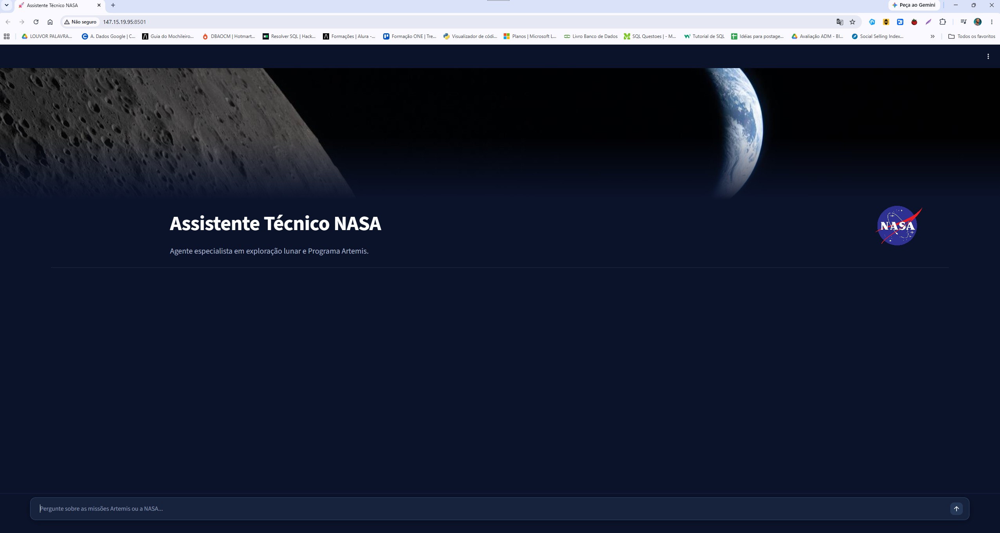

# 🚀 Challenge Alura - Agente RAG - Especialista em Exploração Lunar & NASA

Solução de Inteligência Artificial Generativa desenvolvida durante o **Challenge Oracle Next Education (ONE) & Alura**. O agente atua como um assistente técnico especialista no programa de exploração lunar da NASA (como o Programa Artemis), combinando a busca em documentos locais (**RAG com FAISS**) com consultas em tempo real à **API Oficial da NASA**, além de contar com um sistema de **guard-rails** e **citação obrigatória de fontes**.

---

## 📂 Estrutura do Repositório

```text
alura-agent-rag/
├── Artigo_Streamlit/
│   ├── faiss_index/          # Índice vetorial persistido do FAISS
│   ├── Imagens/              # Recursos visuais e ativos da interface
│   ├── .env                  # Variáveis de ambiente locais (chaves de API)
│   ├── .gitignore            # Arquivos ignorados pelo Git no subdiretório
│   ├── app.py                # Interface Streamlit e lógica do agente
│   └── requirements.txt      # Dependências Python da aplicação
├── data/                     # Documentos técnicos em PDF (Biblioteca da NASA)
├── Evidências/               # Capturas de tela, Metrics OCI

├── infra/                    # Automação de infraestrutura como código (IaC)
│   └── main.tf               # Provisionamento Terraform da OCI (VCN, Subnet e VM)
├── .dockerignore             # Arquivos excluídos do contexto do Docker
├── .gitignore                # Arquivos ignorados pelo Git na raiz
├── 1º_RAG.ipynb              # Notebook de prototipagem e testes do RAG
├── Dockerfile                # Receita de containerização da aplicação
├── memoria_agente.db         # Banco de dados SQLite de memória das sessões
└── README.md                 # Documentação oficial do projeto

```

---

## 🌟 Funcionalidades

### 1. Busca Híbrida de Conhecimento (RAG + API Externa)

* **Ferramenta `pega_contexto_artemis_lunar`:** Realiza busca vetorial (FAISS) nos documentos em PDF armazenados no diretório `data/` sobre o Programa Artemis e exploração lunar.
* **Ferramenta `consulta_api_nasa`:** Atua como um *complemento em tempo real*, permitindo consultar dados dinâmicos da API da NASA para expandir a cobertura do agente.

### 2. Guard-Rail de Escopo

O agente conta com uma camada de segurança lógica configurada via prompt. Se o usuário fizer perguntas fora do domínio de astronomia, espaço ou NASA (como esportes, culinária ou política), as ferramentas de busca **não são acionadas** e o agente retorna uma recusa padronizada:

> *"Sou um agente especialista em responder perguntas sobre a exploração lunar e sobre a NASA. Sua pergunta está fora do meu escopo de conhecimento."*

### 3. Transparência e Rastreabilidade de Fontes

Para evitar alucinações e garantir confiabilidade técnica, **toda resposta baseada em ferramentas é obrigada a indicar explicitamente a origem da informação** na última linha da saída:

* Para documentos locais: `Fonte: [Documento: 'NOME_DO_ARQUIVO.pdf', Página X]`
* Para a API oficial: `Fonte: [Fonte: API da NASA]`

---

## ⚙️ Regras do System Prompt

O comportamento do agente é guiado pelas seguintes diretrizes operacionais:

```text
Você é um assistente técnico especialista da NASA.
Responda à pergunta do usuário de forma DIRETA, OBJETIVA e em Português do Brasil.
Não faça justificativas, introduções ou explicações sobre a busca.

REGRA OBRIGATÓRIA DE CITAÇÃO DE FONTE (NÃO IGNORE):
Toda resposta baseada em ferramentas DEVE seguir o formato de saída abaixo.

- A ferramenta 'pega_contexto_artemis_lunar' retorna o texto com a tag [Documento: 'NOME', Página X]. Você DEVE copiar essa informação exata para a última linha.
- A ferramenta 'consulta_api_nasa' retorna a tag [Fonte: API da NASA].

FORMATO DE SAÍDA OBRIGATÓRIO:
[Sua resposta direta e objetiva aqui]

Fonte: [Insira a citação exata aqui]

REGRA DE FORA DE ESCOPO (MUITO IMPORTANTE):
Se o usuário fizer perguntas que NÃO tenham relação com espaço, astronomia ou NASA (exemplo: esportes, culinária, política, etc.), NÃO USE NENHUMA FERRAMENTA. Responda APENAS:
"Sou um agente especialista em responder perguntas sobre a exploração lunar e sobre a NASA. Sua pergunta está fora do meu escopo de conhecimento."

```

---

## 🚀 Deploy na Oracle Cloud Infrastructure (OCI)

A aplicação está containerizada via Docker e implantada em uma instância Compute na nuvem da Oracle.

* **URL Pública de Acesso:** http://147.15.19.95:8501
* **Provedor Cloud:** Oracle Cloud Infrastructure (OCI)
* **Automação de Infraestrutura:** Terraform (`infra/main.tf` responsável por criar VCN, Subnet Pública, Security Lists e VM)
* **Runtime:** Container Docker rodando em Ubuntu 22.04 LTS com otimização de memória swap e execução em CPU

---

## 🛠️ Tecnologias Utilizadas

* **Linguagem:** Python 3.10
* **Interface Visual:** Streamlit
* **Orquestração de IA & RAG:** LangChain / LangChain Community
* **LLM:** Groq API (`llama-3.3-70b-versatile` / `mixtral-8x7b-32768`)
* **Embeddings & Vector Store:** HuggingFace (`sentence-transformers`) / FAISS
* **APIs Externas:** NASA Open APIs
* **DevOps & Cloud:** Docker, Terraform, OCI Compute

---

## 💻 Como Executar o Projeto Localmente

### Pré-requisitos

* Python 3.10 ou superior
* Chave de API da Groq (`GROQ_API_KEY`) - Link de acesso para criação da API:  https://console.groq.com/keys
* Chave da API da NASA (`NASA_API_KEY`) - Link de acesso para criação da API: https://api.nasa.gov/

### Passo a Passo

1. **Clonar o repositório:**
```bash
git clone https://github.com/GelsonRibeiroJr/alura-agent-rag.git(https://github.com/GelsonRibeiroJr/alura-agent-rag.git)
cd alura-agent-rag

```


2. **Instalar as dependências:**
```bash
pip install -r Artigo_Streamlit/requirements.txt

```


3. **Configurar as variáveis de ambiente:**
Crie o arquivo `.env` dentro da pasta `Artigo_Streamlit/` ou defina no terminal:
```env
GROQ_API_KEY="sua_chave_groq_aqui"
NASA_API_KEY="sua_chave_nasa_aqui"

```


4. **Executar a aplicação:**
```bash
streamlit run Artigo_Streamlit/app.py

```


---

## ❓ Exemplos de Uso e Testes de Escopo

### 1. Pergunta sobre Documentos Lunares (In-Scope - RAG)

* **Pergunta:** *"Quais são os principais objetivos do Programa Artemis para a superfície da Lua?"*
* **Resposta do Agente:** *O programa visa estabelecer uma presença humana sustentável na Lua, testando tecnologias para futuras missões a Marte.*
* **Fonte:** `Fonte: [Documento: 'Artemis_Plan_2020.pdf', Página 12]`

### 2. Pergunta de Escopo Geral da NASA (In-Scope - API)

* **Pergunta:** *"Qual é a foto astronômica do dia (APOD) disponibilizada pela NASA?"*
* **Resposta do Agente:** *A imagem exibe a Nebulosa da Lagoa capturada pelo telescópio espacial.*
* **Fonte:** `Fonte: [Fonte: API da NASA]`

### 3. Teste do Guard-Rail (Out-of-Scope)

* **Pergunta:** *"Quem venceu a última Champions League?"*
* **Resposta do Agente:** *"Sou um agente especialista em responder perguntas sobre a exploração lunar e sobre a NASA. Sua pergunta está fora do meu escopo de conhecimento."*

## 📊 Relatório de Execução e Observabilidade em Nuvem

A validação do sistema foi realizada diretamente no ambiente de produção na **Oracle Cloud Infrastructure (OCI)** no endereço público `http://147.15.19.95:8501`.

---

### 🎥 Demonstração em Vídeo

* 🎥 [Clique aqui para assistir à demonstração em vídeo do Agente rodando na OCI](https://youtu.be/rrwmGt5lxmc)

---

### 📷 Evidências do Agente em Produção e Métricas OCI

* 📂 **[Clique aqui para acessar a pasta de Evidências com todas as capturas e logs](./Evidências/)**

---

#### 1. Interface do Agente, RAG e Citações
<p align="center">
  <br><br>
  <br><br>
  <br><br>
  
</p>

---

#### 2. Execução do Container Docker na VM OCI
<p align="center">
  <br><br>
  <br><br>
  <br><br>
  
</p>

---

#### 3. Monitoramento de Recursos e Métricas OCI
<p align="center">
  <br><br>
  <br><br>
  
</p>
